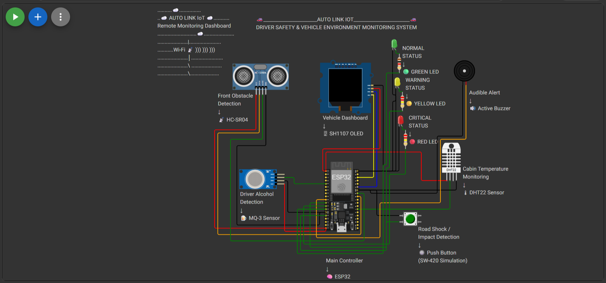

# Hardware Design

## Overview

The AutoLink Driver Safety Monitoring System is built around an ESP32 development board using the ESP-IDF framework.

The hardware integrates multiple sensors and output devices to monitor driver condition, detect potential hazards, and provide both local and cloud-based reporting.

The ESP32 acts as the central controller, collecting sensor data, processing driver safety conditions, controlling output devices, and transmitting important events to the Supabase cloud database.

---

## Hardware Components

The system consists of the following components:

| Component | Purpose |
|-----------|---------|
| ESP32 Development Board | Main controller |
| MQ-3 Alcohol Sensor | Detects alcohol concentration |
| MPU6050 Accelerometer | Detects abnormal vibration and impact |
| HC-SR04 Ultrasonic Sensor | Detects nearby obstacles |
| Temperature Sensor | Monitors cabin temperature |
| OLED Display | Displays system status |
| LEDs | Visual warning indicators |
| Buzzer | Audible warning indicator |

---

## Hardware Layout

The hardware layout was designed in Wokwi to verify wiring connections before deployment to physical hardware.

The layout illustrates the connection between the ESP32 development board and all sensors and output peripherals.

The wiring arrangement was used as the reference during software development.

**Figure 3.1 Hardware Layout of the AutoLink Driver Safety Monitoring System**

---

## System Operation

During operation, the ESP32 continuously reads all connected sensors.

The collected sensor values are processed by the software modules to determine the current driver safety condition.

Depending on the detected state, the controller activates LEDs, the buzzer, updates the OLED display, records important events, and uploads critical information to the Supabase cloud database.
